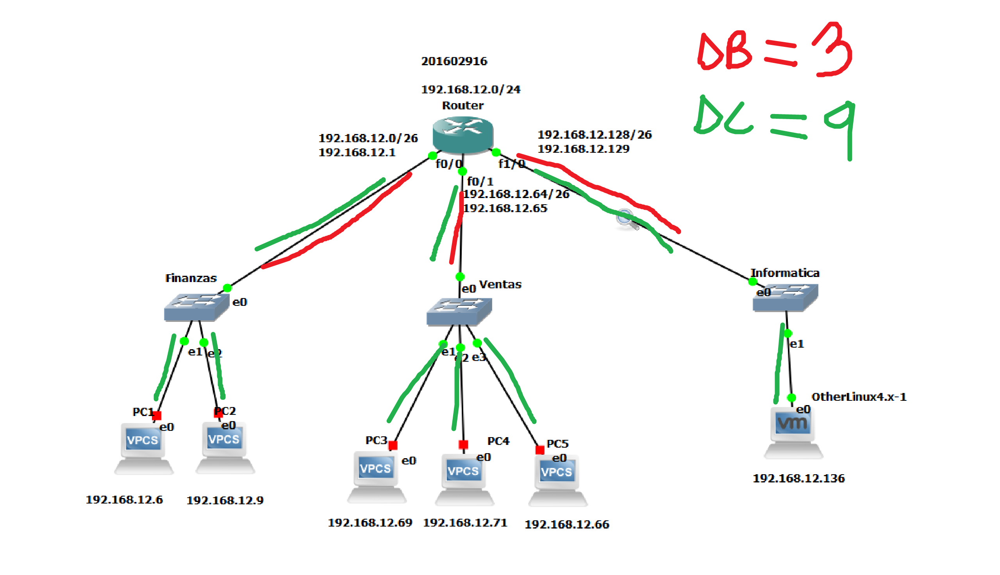
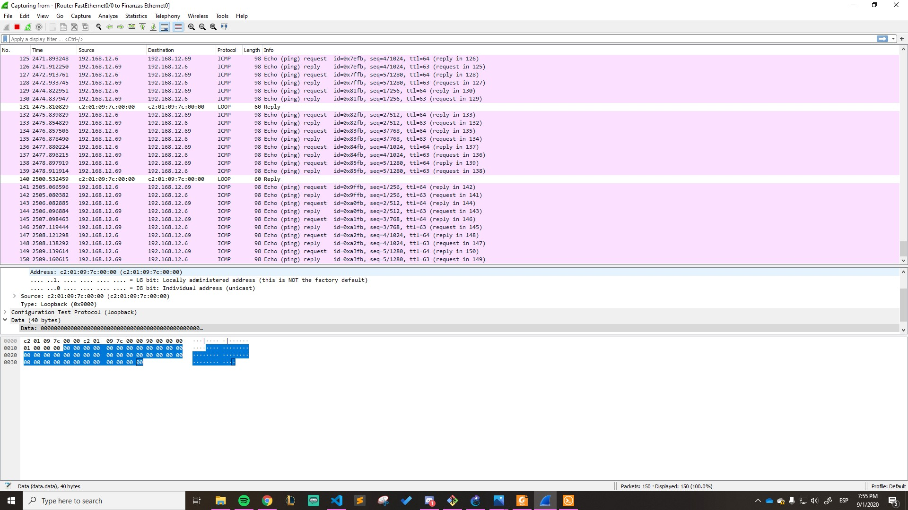
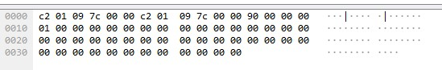

# Practica 2
## Ricardo Antonio Menéndez Tobías
## 201602916

***
# REPORTES

***
## Dominio de Broadcast y de Colisión

| Dispostivo | Colisión | Broadcast |
|---|---|---|
| Router | n | n | 
| Switch | 1 | n | 
| Hub | 1 | 1 | 

### Dominio de Broadcast
El dominio de broadcast es un calculo según la cantidad de "grupos" en los cuales trabajan los routers. Se podría decir que cada interfaz activa de un router pertenece a un dominio de broadcast.

En este caso, el router se conecta con 3 switches en 3 diferentes interfaces, por lo cual el dominio de broadcast sería de __3__.

### Dominio de Colisión

En este caso, el router se conecta con 3 switches en 3 diferentes interfaces, el switch 1 esta con 2 VPCs, el switch 2 con 3 VPCs y el switch 3 con un VM. Por lo cual el dominio de colisión sería de __9__.

***
## Seguimiento de paquetes
Se utilizo wireshark para darle seguimiento al ping de las maquinas.

### Codigo HEXADECIMAL
   c2 01 09 7c 00 00 c2 01 09 7c 00 00 90 00 00 00   
   01 00 00 00 00 00 00 00 00 00 00 00 00 00 00 00   
   00 00 00 00 00 00 00 00 00 00 00 00 00 00 00 00   
   00 00 00 00 00 00 00 00 00 00 00 00               
